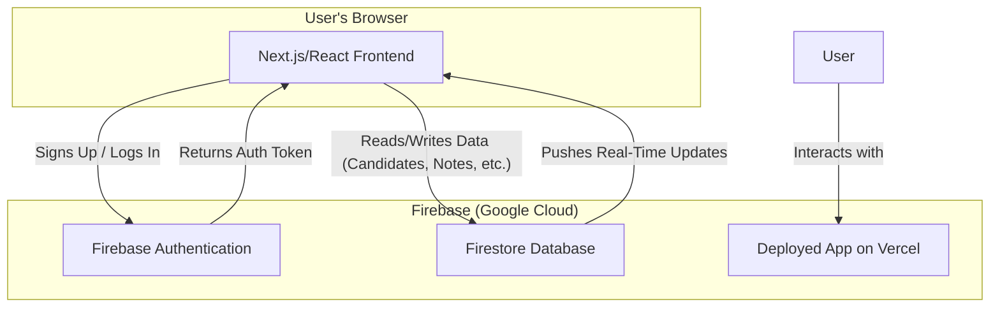

# Technical Documentation - CandidateConnect

This document outlines the technical architecture, technology choices, and potential future enhancements for the CandidateConnect application.

---

## 1. System Architecture

The application follows a modern, serverless, client-centric architecture. The frontend, built with Next.js, is the primary interface for the user and contains all the UI and client-side business logic. It communicates directly with Firebase's backend-as-a-service (BaaS) offerings.

### Architecture Diagram

### Data Flow

1.  **Authentication**: A user interacts with the Next.js frontend. When they sign up or log in, the client communicates directly with **Firebase Authentication**, which verifies their credentials and returns a JSON Web Token (JWT). This token is then used for all subsequent authenticated requests.
2.  **Data Interaction**: All application data is stored in **Firestore**. The Next.js client uses the Firebase SDK to perform CRUD (Create, Read, Update, Delete) operations directly on the database.
3.  **Real-Time Sync**: For features like notes and notifications, the client establishes a real-time listener with Firestore. Whenever data is changed in the database by one user, Firestore automatically pushes the updated data to all other subscribed clients, enabling seamless collaboration without manual polling.
4.  **Security**: Data access is not controlled by the client but is enforced by **Firestore Security Rules** on the backend. These rules ensure that users can only access the data they are explicitly authorized to see or modify.

---

## 2. Libraries, Frameworks, and Services

*   **[Next.js](https://nextjs.org/)**: Chosen as the React framework for its powerful features like server-side rendering, file-based routing, and seamless integration with Vercel for deployment.
*   **[Firebase](https://firebase.google.com/)**: Serves as the complete backend for the application.
    *   **Firebase Authentication**: Handles all user identity management, including email/password sign-up, login, and session management.
    *   **Firestore**: A scalable, real-time NoSQL database used to store all application data, including users, candidates, notes, and history. Its real-time capabilities are central to the app's collaborative features.
*   **[ShadCN UI](https://ui.shadcn.com/)**: A component library used for building the user interface. It provides a set of accessible, unstyled components that can be easily customized with Tailwind CSS, accelerating development while maintaining full control over the visual design.
*   **[Tailwind CSS](https://tailwindcss.com/)**: A utility-first CSS framework used for all styling. It allows for rapid and consistent UI development directly within the component markup.
*   **[Sonner](https://sonner.emilkowal.ski/)**: A lightweight and elegant library for displaying toast notifications, used for providing users with non-intrusive feedback on their actions.

---

## 3. Potential Future Enhancements

Given more time, the following features would be implemented to further enhance the application:

1.  **Advanced Search and Filtering**: Implement a powerful search bar on the main dashboard to allow users to quickly find candidates by name, role, or status. Add filtering options to narrow down the candidate list based on specific criteria.
2.  **User Avatar Uploads**: Allow users to upload a profile picture. This would be implemented using **Firebase Storage** to store the image files, and the URL would be linked in the user's Firestore document.
3.  **Email Notifications**: In addition to in-app notifications, set up transactional email alerts for critical events like being mentioned in a note. This would be implemented using a **Firebase Cloud Function** that triggers on a new document creation in the `notifications` sub-collection and uses a service like **SendGrid** or **Resend** to dispatch the email.
4.  **Dashboard Analytics**: Create a dedicated analytics section on the dashboard showing key metrics like the number of candidates hired vs. rejected, average time-to-hire, and which roles are receiving the most applications. This would provide valuable insights for recruiting managers. 